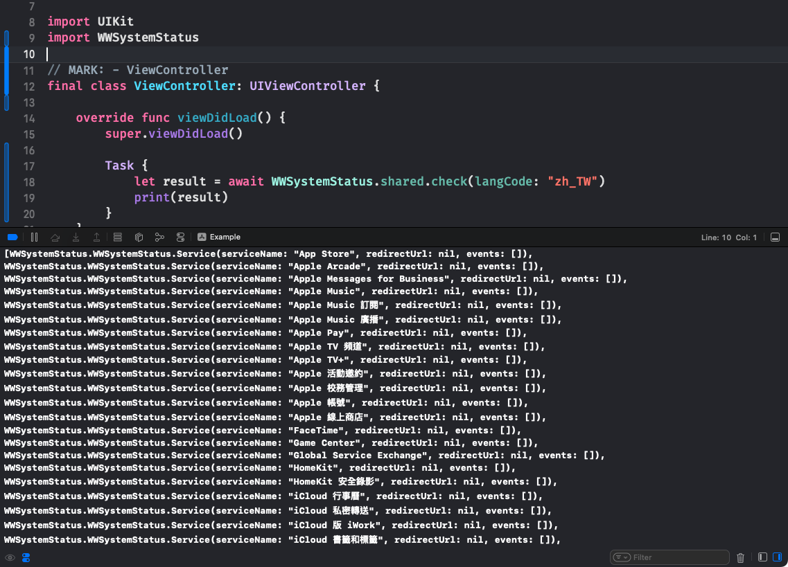

# WWSystemStatus

[](https://developer.apple.com/swift/) [](https://developer.apple.com/swift/)  [](https://developer.apple.com/swift/) [](https://developer.apple.com/swift/)

## [Introduction - 簡介](https://swiftpackageindex.com/William-Weng)
- [Get various system status values ​​supported by Apple.](https://www.apple.com/support/systemstatus/)
- [取得Apple支援的各系統狀態數值。](https://www.apple.com/tw/support/systemstatus/)



### [Installation with Swift Package Manager](https://medium.com/彼得潘的-swift-ios-app-開發問題解答集/使用-spm-安裝第三方套件-xcode-11-新功能-2c4ffcf85b4b)
```
dependencies: [
    .package(url: "https://github.com/William-Weng/WWSystemStatus.git", .upToNextMajor(from: "1.0.1"))
]
```

### [Function - 可用函式](https://gitbook.swiftgg.team/swift/swift-jiao-cheng)
|函式|功能|
|-|-|
|response(langCode:)|取得各相關系統系統狀態數值原始資料|
|check(langCode:)|取得各相關系統系統狀態數值|

## [Example](https://ezgif.com/video-to-webp)
```swift
import UIKit
import WWSystemStatus

final class ViewController: UIViewController {
    
    override func viewDidLoad() {
        super.viewDidLoad()
        
        Task {
            let result = await WWSystemStatus.shared.check(langCode: "zh_TW")
            print(result)
        }
    }
}
```
